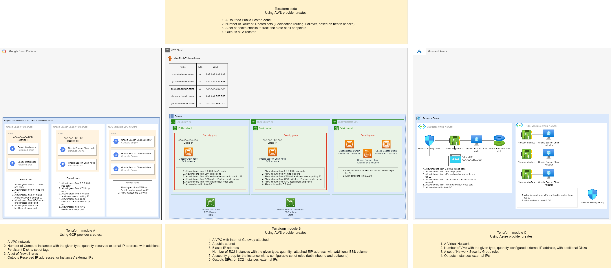

# Gnosis Beacon Chain Validator

  

The repository contains Infractructure as Code (IaC) resources to deploy 
Gnosis Beacon Chain validators in a decentralized manner.

## TOC
- [How to use](#how-to-use)
- [Description](#description)
- [Architecture](#architecture)
  - [Connections](#connections)
  - [Endpoints](#endpoints)
- [Infrastructure](#infrastructure)
- [Prerequisites](#prerequisites)
- [License](#license)

## Description

This repository is designed to provide a simple way to deploy [Gnosis Beacon Chain (GBC)](https://docs.gnosischain.com/)
validators distributed across multiple instances, regions and clouds.

Running instances in this decentralised fashion proves to provide better 
fault-tolerance, risk management and might also increase your rewards.
> **_NOTE:_** You can use this repo to deploy single cloud/region installations as well ;)

The communication between [Gnosis Chain (GC) Nodes](
https://docs.gnosischain.com/clients/gnosis-chain-node-openethereum-and-nethermind/nethermind-node-setup),
[GBC Nodes](https://docs.gnosischain.com/clients) and 
[GBC Validators](https://docs.gnosischain.com/clients) resources 
flows through the Internet. Instances has a predefined set of whitelisted IPs.

The list of supported Cloud Providers:
- [Amazon Web Services](https://aws.amazon.com/) (AWS)
- [Google Cloud Platform](https://cloud.google.com/) (GCP)
- [Microsoft Azure](https://azure.microsoft.com/) (Azure)

The list of supported Gnosis Beacon Chain clients:
- [Lighthouse](https://docs.gnosischain.com/clients/lighthouse)

## How to use

In order to deploy the GBC Validators you will need to:

0. Install [prerequisites](#prerequisites)
1. Generate [GBC validator's keystores](https://docs.gnosischain.com/validator-info/validator-deposits), if you don't have it already 
2. Deploy the infrastructure using Terraform 
([instruction](terraform))
3. Deploy the application on the created infrastructure using Ansible 
([instruction](ansible))

> **_NOTE:_** In case you want to deploy the GBC Validators on other instances (e.g., bare metal) that are not deployed using Terraform, then you can skip step number 2.

## Prerequisites

- Cloud provider account(s):
  - [AWS](https://aws.amazon.com/premiumsupport/knowledge-center/create-and-activate-aws-account/)
  - [GCP](https://cloud.google.com/apigee/docs/hybrid/v1.1/precog-gcpaccount)
  - [Azure](https://docs.microsoft.com/en-us/learn/modules/create-an-azure-account/)
- [Terraform](https://learn.hashicorp.com/tutorials/terraform/install-cli)
- [Ansible](https://docs.ansible.com/ansible/latest/installation_guide/intro_installation.html#installing-ansible-on-specific-operating-systems)
- [Python3](https://docs.python-guide.org/starting/installation/) 
- [GBC Validator's keystores](https://github.com/gnosischain/validator-data-generator)

> **_NOTE:_** Links provide instructions for obtaining the necessary prerequisites.

## Architecture
(open in a new tab for a better visibility)

### Connections

| Service       | Component  | Network                                      | Services connections   |
|---------------|------------|----------------------------------------------|------------------------|
| GC Node       | Nethermind | rpc:8545, ws-rpc:8546, peering:30303, ssh:22 | GBC Node               |
| GBC Node      | Lighthouse | rpc:5052, ws-rpa:5052, peering:9000, ssh:22  | GC Node, GBC Validator |
| GBC Validator | Lighthouse | ssh:22                                       | GBC Node               |

### Endpoints

| Service  | URL                         |
|----------|-----------------------------|
| GC Node  | http://gc-node.example.com  |
| GBC Node | http://gbc-node.example.com |

## Infrastructure

The entire infrastructure is deployed with [Terraform](https://www.terraform.io/). All applications run in docker containers managed by docker-compose.

The infrastructure components to be deployed depends on the specific cloud provider:

| Component                        | Cloud provider | Services                                                         |
|----------------------------------|----------------|------------------------------------------------------------------|
| GC Node, GBC Node, GBC Validator | AWS            | VPC, EC2, EBS, EIP                                               |
|                                  | GCP            | Compute Network, Compute Address, Compute Disk, Compute Instance |
|                                  | Azure          | Virtual Network, Public IP, Managed Disk, Virtual Machine        |
| DNS records and health checks    | AWS            | Route53 Hosted zone, Health checks                               |

> **_NOTE:_** By default, AWS Route53 is used to create DNS records and health checks, but this can be disabled.
> Also the Terraform tfstate file is stored in AWS S3 by default, but this behavior can be disabled.

## License

The contents of this repository are licensed under the Apache 2.0 License - see the [LICENSE](LICENSE) file for details.
